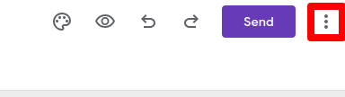
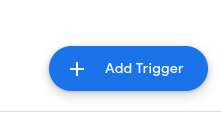
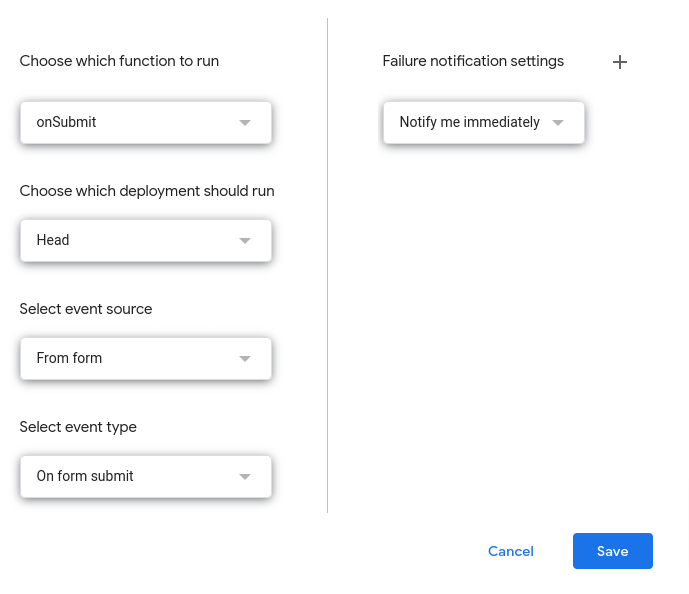

# google-form-on-submit

Submitting a webhook upon Google form submission.

## Instructions

Navigate to https://forms.google.com and open the form that will trigger the webhook.

At the upper right hand side of the edit form page, select icon with three stacked dots followed
by `Script Editor`

The sample code is found in the `onsubmit.js` file found in the root of this repository. Copy
and paste that into the editor. At a minimum, modify the `POST_URL` variable to point to the
desired endpoint that will be called upon form submission.

The `onSubmit` function now needs to be mapped as a trigger. This can be done by expanding the
navigation menu on the left hand side of your browser and selecting `Triggers`.

Select `Add Trigger` at the bottom right of the page.

The trigger should be configured as shown in the screenshot below.

